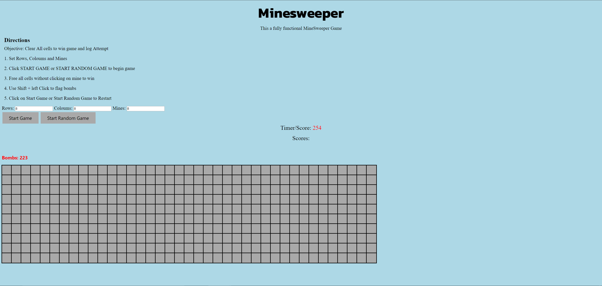

# Minesweeper-Js

## How to open:  

1. Clone Repository `git clone https://github.com/shaikster101/Minesweeper-Js.git `
2. Click on Minesweeper file

## How to Play: 

1. Click on Start game to begin. 
1. You can customize the grid size and number of bombs or Randomize it using Random Grid Generator
1. Click on a cell to clear it and adjacent free ones.
1. Play till you clear the grid 
1. Its *Game Over* if you click on a bomb!
1. You can toggle flags on shift + click to track known bombs
1. Enjoy!

## Backend made using vanilla JS nad Jquery. 
## Front end using CSS and HTML

